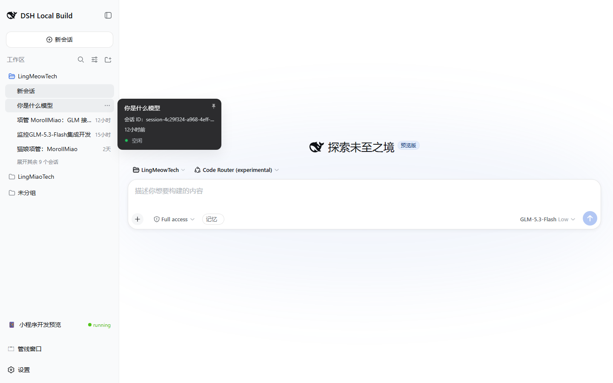
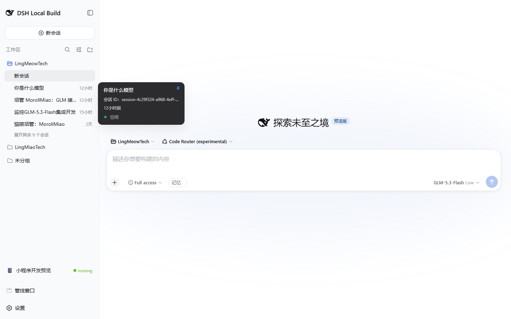

# Relay: session hover panel visual regression (Playwright)

English | [中文](visual-regression.zh.md)

- **Stage**: [job3/3] Playwright end-to-end acceptance (post-merge wrap-up for `dev-20260819-session-hover-pin` → `dev`)
- **Status**: ✅ Done
- **Branch**: `dev` (merged; merge commits `8eb0f9679d`, `d8b881a3cf`)
- **Date**: 2026-08-28 (UTC+8)

## Scope

Post-merge wrap-up of issue #8 (LingMeowTech/dsh-lmtech-plugins): verify the merged
HoverCard pin state and the session id row on the running web UI at
`http://127.0.0.1:3080` (DSH web GUI, `dev` build serving `dev` worktree sources).

## Build/test gates (affected packages only)

- `vitest run packages/client/ui-primitives/tests/hover-card.client.spec.tsx packages/client/ui-workspace/tests/rows.client.spec.tsx` → 2 files / 56 tests all pass
- `tsc -b packages/client/ui-primitives/tsconfig.json` → exit 0
- `tsc -p packages/client/ui-workspace/tsconfig.json --noEmit` → exit 0

## Visual regression result (Playwright 1.61.1, Chromium headless, 1440×900)

| Step | Action | Expected | Result |
| --- | --- | --- | --- |
| 1 | Open `http://127.0.0.1:3080`, hover a real session row (workspace tree `[role=tree]`, `treeitem` nth 2) | Hover card appears | ✅ |
| 2 | Inspect card text | Contains `会话 ID：{id}` (session id row) | ✅ (`body-has-session-id: true`) |
| 3 | Inspect pin button | Present; `aria-pressed="false"` initially | ✅ |
| 4 | Click pin | Label flips to `取消固定`, `aria-pressed="true"` | ✅ |
| 5 | Move pointer away (900, 700), wait ~1.6s | Pinned card stays visible | ✅ (`panel stays: true`) |
| 6 | Unpin (click again) | Card returns to hover behavior | ✅ (script unpin, no error) |

Screenshots:

- Hover card with session id + pin button: 
- Card stays open after pointer leaves while pinned: 

Assertion script: headless Playwright over the running GUI; assertions printed at
run time and quoted in this record. Test evidence timestamps: 2026-08-28 01:31
(local).

## Conclusion

The merged session hover panel behaves as specified end to end on the real web
UI: the card shows the copyable session id row, exposes a pin button whose
`aria-pressed` reflects the pinned state, and a pinned card remains open after
the pointer leaves. Build/type gates for both affected packages stay green.
Issue #8 wrap-up is confirmed; the issue stays open (not closed by this job).
